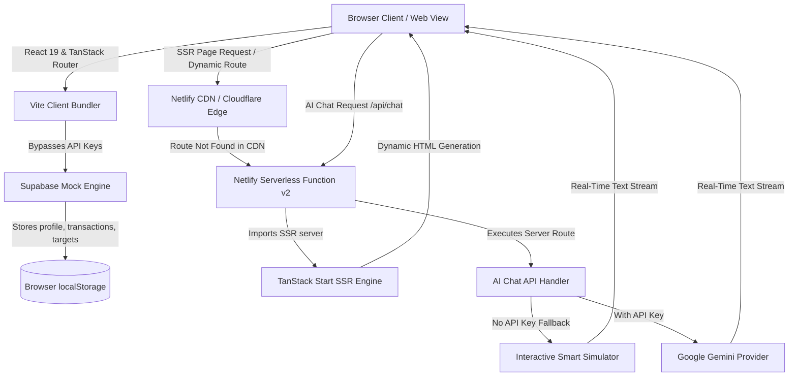

# 🇧🇩 CASh-E Amar Desh Super-App
### *Built for Every Bangladeshi Life — A Premium Full-Stack Financial Super-App*

[](https://cash-e.netlify.app)
[](https://react.dev)
[](https://tanstack.com/start)
[](https://tailwindcss.com)
[](https://typescriptlang.org)
[](https://cash-e.netlify.app)

---

**CASh-E Amar Desh** is a premium, state-of-the-art full-stack super-app built with **TanStack Start**, **React 19**, and **Tailwind CSS v4**. Specifically customized for the financial, agricultural, and educational realities of Bangladesh, it empowers everyday citizens to budget, save, request micro-loans, purchase utilities, and access bilingual financial education directly in a single beautiful dashboard.

👉 **Experience the Live Application:** [https://cash-e.netlify.app](https://cash-e.netlify.app)

---

## 🌟 Key Application Features

| Module | Feature | Bengali Localization | Premium Visual Detail |
| :--- | :--- | :--- | :--- |
| **🤖 AI Financial Coach** | Bilingual streaming chat support, providing personalized advice on budgeting, student stipends, and farming. | *CASh-E এআই (Financial Bondhu)* | Glassmorphism chat bubble layout with intelligent stem-matching fallback simulation. |
| **🎯 Sanchay (Savings)** | Create custom savings targets (Eid, Business, Education) with daily/weekly auto-deposit plans. | *সঞ্চয় স্কিম* | Responsive circular progress charts, real-time balance calculations. |
| **🚜 Khamar (Agri-Finance)** | Instant agricultural micro-loans, poultry/crop insurance, and market linkage portals. | *খামার ফাইনান্স* | Step-by-step interactive loan calculator and insurance setup forms. |
| **🎓 Student Mode** | Designated budgeting tools, stipend tracking, and student-exclusive discount marketplaces. | *স্টুডেন্ট বাজেট* | 50/30/20 budget helper and special cashbacks. |
| **⚡ Utility & Bill Pay** | Dynamic bill settlement (Electricity, Water, Gas, Internet) with zero-fee introductory offers. | *বিল পে ও পোস্টপে* | Integration with **PostPay** (Buy Now, Pay Later credit). |
| **🛍️ Bazaar & Bundles** | Exclusive retail offers, mobile data packages, OTT subscriptions, and farming essentials. | *বাজার ও বান্ডেল* | Grid-based ecommerce layout with quick filters. |
| **📱 QR Transactions** | QR-code generated transfers to instantly send or receive money. | *QR লেনদেন* | Live scan simulation and dynamic mock transaction logs. |

---

## 🏗️ Architecture & Data Strategy

CASh-E is designed to run **completely stand-alone with zero external database dependencies** for demo and staging environments, while retaining a full-stack production-ready foundation.



### 💾 Persistent Local Mock Database
The client resolution of `@/integrations/supabase/client` is automatically mapped in the compiler to the custom [supabase-mock.ts](file:///e:/Cash%20E/amar-desh-digital-main/amar-desh-digital-main/src/lib/supabase-mock.ts). 
* Implements robust local database tables (`profiles`, `transactions`, `savings`, `missions`).
* Intercepts and replicates database RPC calls.
* Writes all state updates directly to browser `localStorage`, ensuring data survives hard page refreshes.

---

## 🛠️ Technology Stack

* **Core Framework:** [TanStack Start](https://tanstack.com/start) (Full-Stack React Framework built on Vinxi/Vite)
* **View Layer:** React 19 (Server Actions, Suspense, streaming HTML hydration)
* **Routing & Queries:** TanStack Router & TanStack Query v5
* **Styling & Transitions:** [Tailwind CSS v4](https://tailwindcss.com) (Modern design system, custom grid-layouts, and curations)
* **Icons & Animation:** Lucide-React & Tailwind-Animate (Micro-interactions, soft hover effects, and slide-ins)
* **Production SSR Host:** Netlify (using Netlify Functions v2 and fallback CDN caching rules)

---

## 💻 Local Development Setup

Follow these simple steps to run the application locally in under 3 minutes:

### 1. Prerequisites
Ensure you have [Node.js v22+](https://nodejs.org) and [npm](https://npmjs.com) installed.

### 2. Clone and Install
```bash
# Clone the repository
git clone https://github.com/sohancreation/cash-e.git
cd cash-e

# Install dependencies
npm install
```

### 3. Run Development Server
```bash
npm run dev
```
Open your browser and navigate to **`http://localhost:8080`** to view the app!

### 4. Build for Production
```bash
npm run build
```
This compiles client static assets to `dist/client` and the SSR worker to `dist/server`.

---

## 🚀 Deployment Playbook

CASh-E is fully optimized for dual high-performance hosting platforms:

### 📥 Option A: Netlify (Live Environment)
Our dynamic routing architecture leverages a hybrid CDN/Serverless model via **Netlify Functions v2**:
1. **Static Files:** Served directly from `dist/client` via Netlify CDN at peak speeds.
2. **Dynamic/SSR Pages:** Catch-all redirects (`/* -> /.netlify/functions/server`) dynamically run the SSR build under Netlify's high-performance serverless Node.js runtime.

**Configuration (`netlify.toml`):**
```toml
[build]
  command = "npm run build"
  publish = "dist/client"
  functions = "netlify/functions"

[[redirects]]
  from = "/*"
  to = "/.netlify/functions/server"
  status = 200
```

### 📥 Option B: Cloudflare Workers
The server builds an ESModule optimized for edge workers:
* Configure environment bindings in [wrangler.jsonc](file:///e:/Cash%20E/amar-desh-digital-main/amar-desh-digital-main/wrangler.jsonc).
* Automatically deployed on every push via `.github/workflows/deploy.yml` with the Wrangler GitHub Action.

---

## 🎨 Premium Design System Details
* **Theme Harmony:** CURATED dark modes incorporating vibrant gold highlights (`#F59E0B`), warm emerald hues, and responsive safe-area containers.
* **Glassmorphic Cards:** Translucent interfaces with soft border borders and backdrop-blur effects.
* **Fluid Micro-Animations:** Floating action-sheets, slide-in lists, and real-time status pulses that respond naturally to user actions.

---

## 📄 License
This project is private and proprietary. Developed with ❤️ for Bangladesh.
